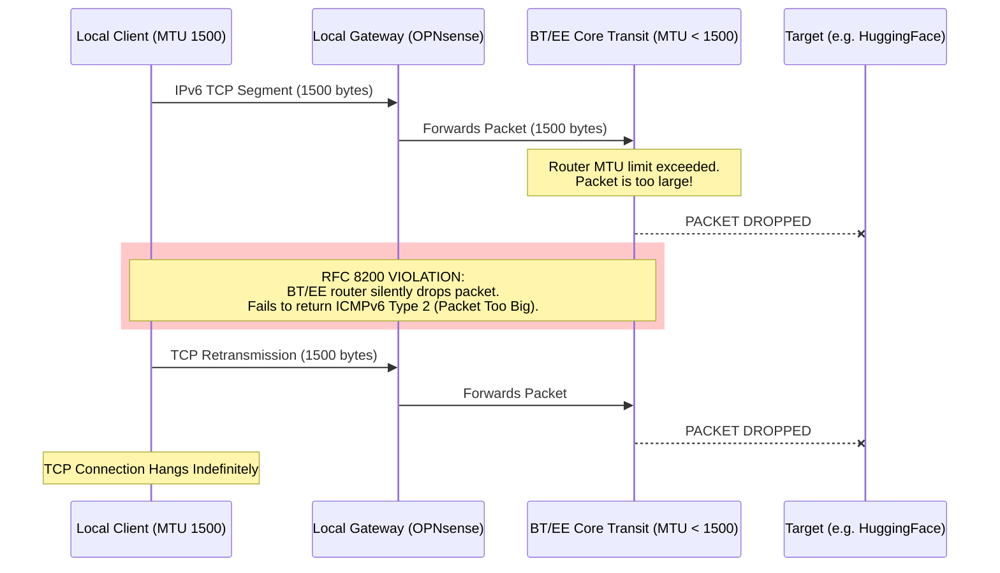

# BT/EE IPv6 PMTUD Blackhole Fault Report

A forensic analysis and automated diagnostic tool documenting severe IPv6 Path MTU Discovery (PMTUD) black holes within the **BT/EE core transit network**. 

This repository contains the telemetry and tooling used to prove that specific BT/EE peering routers are violating RFC 8200, resulting in severe TCP hangs that disrupt AI, cloud, and software engineering workflows.

📖 **Want to run the diagnostic tool yourself? See the [Usage Guide](USAGE.md).**

---

## Executive Summary for BT/EE NOC
* **The Fault:** Upstream BT/EE transit routers are silently dropping 1500-byte IPv6 packets without returning the mandatory `ICMPv6 Type 2 (Packet Too Big)` messages.
* **The Impact:** Standard PMTUD fails. Large TCP streams (Docker pulls, AI model downloads, large API responses) hang indefinitely. Mobile/IoT devices suffer excessive battery drain.
* **The Proof:** Raw wire taps confirm local hardware is correctly configured for Baby Jumbo Frames (RFC 4638) and packets leave the premises at 1500 bytes, but vanish completely at specific BT/EE hops (e.g., within `2a00:2380::`).

## The Problem: RFC 8200 Non-Compliance

Modern dual-stack and IPv6-only environments rely on **Path MTU Discovery (PMTUD)** to negotiate packet sizes. If a packet is too large for a specific router along a path, that router must drop the packet and return an `ICMPv6 Type 2 (Packet Too Big)` message to the sender, allowing the connection to gracefully resize its payload.

**The Symptom:** Small packets (SSH, DNS) work perfectly. Large TCP streams hang indefinitely.

**The Cause:** BT/EE transit routers are routing IPv6 traffic over infrastructure with an MTU below the standard 1500 bytes. Crucially, these routers are dropping oversized packets **without returning the required ICMPv6 Type 2 errors.**

### The PMTUD Blackhole Sequence

### The Hidden Impact: OS Fallback & Hardware Battery Drain

If the path is broken, why aren't all BT/EE customers noticing the outage? 

Modern operating systems (macOS, Linux, iOS) employ aggressive error-recovery algorithms—such as **TCP Blackhole Detection** and **Happy Eyeballs (RFC 8305)**—to survive degraded networks. When a client stack encounters a silent drop, it waits for a TCP Retransmission Timeout (RTO), exponentially backs off, and eventually forces a fallback to IPv4 or a minimal MSS probe.

While this client-side emergency recovery masks the core network failure for casual web browsing (manifesting merely as a "sluggish" page load), it introduces severe, compounding failures across the ecosystem:

1. **Application Timeouts:** AI agents, CI/CD pipelines, and cloud-native tools (like `docker pull` or `git`) have strict application-layer timeouts. These tools frequently fail entirely *before* the OS network stack finishes its lengthy fallback routine. 
2. **Mobile and IoT Battery Drain:** For mobile phones (EE) and embedded devices, Wi-Fi and cellular radios are designed to transmit, receive an ACK, and immediately return to a low-power sleep state. Silent packet drops force the network interface to stay "awake" in a high-power active state for several seconds while it waits for RTOs and processes retransmissions. This extended "radio tail time" directly and unnecessarily degrades device battery life.

**Relying on end-user operating systems to perform emergency recovery in order to mask an RFC violation introduces excessive latency, degrades connection reliability, and unnecessarily drains consumer hardware batteries.**

## March 2026 Observations

Following a complete verification of local hardware transparency (confirming a "True 1500" MTU path from the local LAN through the BT ONT), the following forensic data was captured. 

### 1. The "True 1500" Control Group
The following destinations successfully negotiated a full **1500-byte MTU**. This proves the local gateway and physical BT link are correctly configured for Baby Jumbo Frames (RFC 4638) and are **not** the source of the bottleneck:
* `api.x.ai`
* `cloudflare.com`
* `gitlab.com`
* `www.apple.com`
* `repo1.maven.org`
* `crates.io`
* `www.theguardian.com`

### 2. Verified BT/EE Black Holes (Silent Drops)
These endpoints fail standard Ethernet MTU (1500 bytes). Diagnostics confirm the packets leave the local network but vanish in the BT/EE transit core. Binary search calculates the effective MTU ceiling and identifies the last responding router before the "Black Hole."

| Target Domain | Path MTU | Last Responding Hop (BT/EE Drop Hop) | Status |
| :--- | :--- | :--- | :--- |
| `huggingface.co` | **1280** | *Unknown (Silent Drop)* | **Critical** |
| `cloud.google.com` | **1280** | `2001:4860:0:1::7e80` | **Critical** |
| `www.google.com` | **1280** | `2a00:2380:2015:3000::1d` | **Critical** |
| `proxy.golang.org` | **1280** | `2a00:2380:106::99` | **Critical** |
| `pypi.org` | **1321** | `2a00:2380:106::a7` | **Anomalous** |
| `www.spotify.com` | **1372** | `2a00:2380:106::ef` | **Anomalous** |
| `news.ycombinator.com`| **1280** | `2a00:2000:2066::73` | **Critical** |
| `www.wikipedia.org` | **1280** | `2a11:4140:5002::d` | **Critical** |

## Forensic Evidence: The "Smoking Gun"

Using the `--verify-ptb` (Wiretap) mode, raw packet captures were performed on the physical interface during 1500-byte transmissions. 

**Observations:**
1. **Zero ICMPv6 Type 2 Messages:** For all "Critical" paths listed above, the local interface verified the complete absence of "Packet Too Big" responses from the BT/EE network. 
2. **Immediate Vanishing:** Traceroute diagnostics confirm that packets vanish immediately after entering specific BT/EE prefixes (notably `2a00:2380::`), associated with core transit and peering infrastructure.
3. **PMTUD Failure:** Because no PTB message is returned, the client OS continues to attempt 1500-byte transmissions, leading to the observed TCP hangs.

## Reproduction for BT/EE Network Engineers

To reproduce these observations from a terminal on a BT/EE connection:

1. **Verify Local Transparency (Success):**
   `ping6 -D -s 1452 api.x.ai` (Expected: 0% loss)

2. **Demonstrate Upstream Black Hole (Failure):**
   `ping6 -D -s 1452 huggingface.co` (Expected: 100% loss / Request Timeout)

3. **Isolate the Ceiling:**
   `ping6 -D -s 1232 huggingface.co` (Expected: 0% loss at 1280 MTU)

---

## 🚨 FINAL CONCLUSION: The RFC 8200 Violation

To be absolutely clear: **The core fault is not the reduced MTU itself.** Running transit links, tunnels, or peering exchanges at a lower MTU (such as 1280 bytes / 1220 MSS) is entirely within the IPv6 specification. The critical infrastructure failure is that the BT/EE core is acting as a **silent black hole**.

By dropping oversized packets *without* generating and returning the mandatory `ICMPv6 Type 2 (Packet Too Big)` messages, the BT/EE network completely breaks standard **Path MTU Discovery (PMTUD)**. This infrastructure failure leaves client TCP stacks entirely blind to the route's constraints, preventing local systems from adapting their payload sizes, and resulting directly in the severe, indefinite TCP hangs documented in this report.
