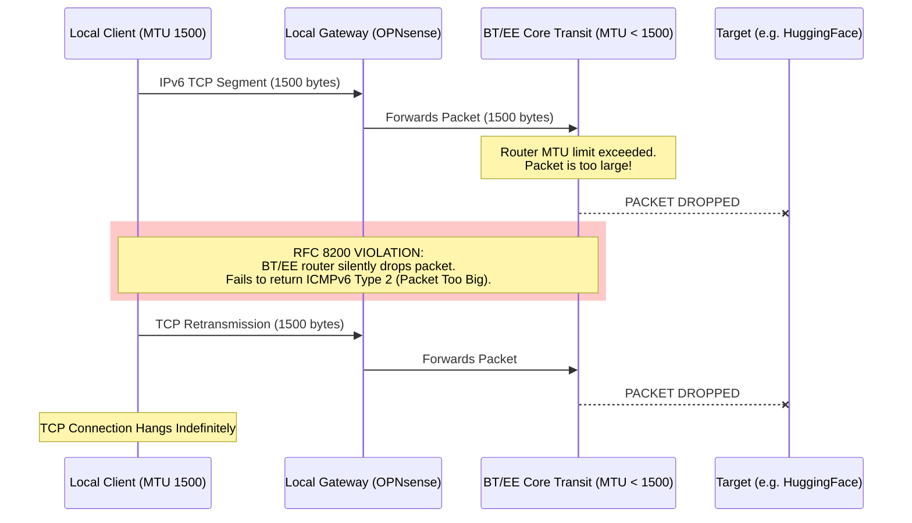
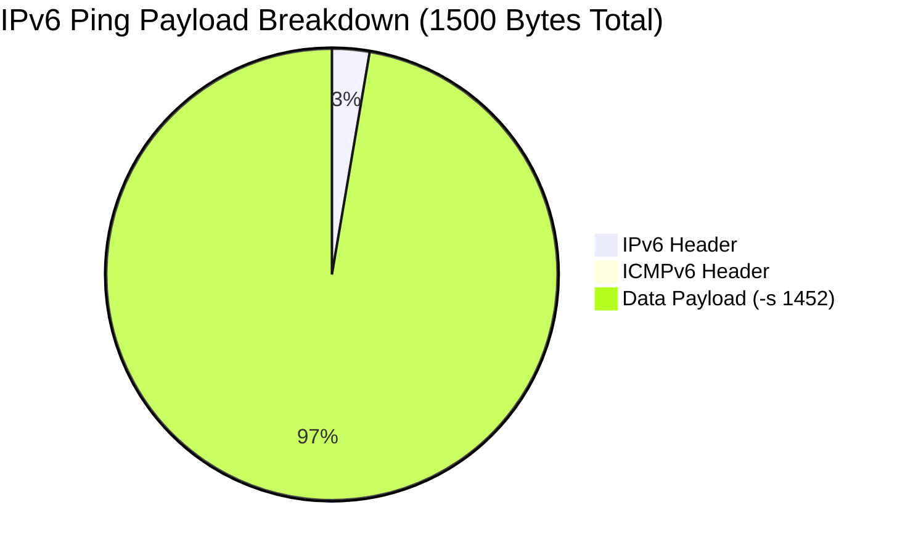

# BT/EE IPv6 PMTUD Blackhole Fault Report

A forensic analysis and automated diagnostic tool documenting severe IPv6 Path MTU Discovery (PMTUD) black holes within the **BT/EE core transit network**. 

This repository contains the telemetry and tooling used to prove that specific BT/EE peering routers are violating RFC 8200, resulting in severe TCP hangs that disrupt AI, cloud, and software engineering workflows.

📖 **Want to run the diagnostic tool yourself? See the [Usage Guide](USAGE.md).**

---

## Executive Summary for BT/EE NOC
* **The Fault:** Upstream BT/EE transit routers are silently dropping 1500-byte IPv6 packets without returning the mandatory `ICMPv6 Type 2 (Packet Too Big)` messages.
* **The Impact:** Standard PMTUD fails. Large TCP streams (Docker pulls, AI model downloads, large API responses) hang indefinitely. 
* **The Proof:** Raw wire taps confirm local hardware is correctly configured for Baby Jumbo Frames (RFC 4638) and packets leave the premises at 1500 bytes, but vanish completely at specific BT/EE hops (e.g., within `2a00:2380::`).

## The Problem: RFC 8200 Non-Compliance

Modern dual-stack and IPv6-only environments rely on **Path MTU Discovery (PMTUD)** to negotiate packet sizes. If a packet is too large for a specific router along a path, that router must drop the packet and return an `ICMPv6 Type 2 (Packet Too Big)` message to the sender, allowing the connection to gracefully resize its payload.

**The Symptom:** Small packets (SSH, DNS) work perfectly. Large TCP streams hang indefinitely.

**The Cause:** BT/EE transit routers are routing IPv6 traffic over infrastructure with an MTU below the standard 1500 bytes. Crucially, these routers are dropping oversized packets **without returning the required ICMPv6 Type 2 errors.**

### The PMTUD Blackhole Sequence

## March 2026 Observations

Following a complete verification of local hardware transparency (confirming a "True 1500" MTU path from the local LAN through the BT ONT), the following forensic data was captured. 

### 1. The "True 1500" Control Group
The following destinations successfully negotiated a full **1500-byte MTU**. This proves the local gateway and physical BT link are correctly configured for Baby Jumbo Frames (RFC 4638) and are **not** the source of the bottleneck:
* `api.x.ai`
* `cloudflare.com`
* `gitlab.com`
* `www.apple.com`
* `repo1.maven.org`
* `crates.io`
* `www.theguardian.com`

### 2. Verified BT/EE Black Holes (Silent Drops)
These endpoints fail standard Ethernet MTU (1500 bytes). Diagnostics confirm the packets leave the local network but vanish in the BT/EE transit core. Binary search calculates the effective MTU ceiling and identifies the last responding router before the "Black Hole."

| Target Domain | Path MTU | Last Responding Hop (BT/EE Drop Hop) | Status |
| :--- | :--- | :--- | :--- |
| `huggingface.co` | **1280** | *Unknown (Silent Drop)* | **Critical** |
| `cloud.google.com` | **1280** | `2001:4860:0:1::7e80` | **Critical** |
| `www.google.com` | **1280** | `2a00:2380:2015:3000::1d` | **Critical** |
| `proxy.golang.org` | **1280** | `2a00:2380:106::99` | **Critical** |
| `pypi.org` | **1321** | `2a00:2380:106::a7` | **Anomalous** |
| `www.spotify.com` | **1372** | `2a00:2380:106::ef` | **Anomalous** |
| `news.ycombinator.com`| **1280** | `2a00:2000:2066::73` | **Critical** |
| `www.wikipedia.org` | **1280** | `2a11:4140:5002::d` | **Critical** |

### Payload Math Verification

## Forensic Evidence: The "Smoking Gun"

Using the `--verify-ptb` (Wiretap) mode, raw packet captures were performed on the physical interface during 1500-byte transmissions. 

**Observations:**
1. **Zero ICMPv6 Type 2 Messages:** For all "Critical" paths listed above, the local interface verified the complete absence of "Packet Too Big" responses from the BT/EE network. 
2. **Immediate Vanishing:** Traceroute diagnostics confirm that packets vanish immediately after entering specific BT/EE prefixes (notably `2a00:2380::`), associated with core transit and peering infrastructure.
3. **PMTUD Failure:** Because no PTB message is returned, the client OS continues to attempt 1500-byte transmissions, leading to the observed TCP hangs.

## Reproduction for BT/EE Network Engineers

To reproduce these observations from a terminal on a BT/EE connection:

1. **Verify Local Transparency (Success):**
   `ping6 -D -s 1452 api.x.ai` (Expected: 0% loss)

2. **Demonstrate Upstream Black Hole (Failure):**
   `ping6 -D -s 1452 huggingface.co` (Expected: 100% loss / Request Timeout)

3. **Isolate the Ceiling:**
   `ping6 -D -s 1232 huggingface.co` (Expected: 0% loss at 1280 MTU)

**Conclusion:** The BT/EE infrastructure at `2a00:2380::` and related peering points is failing to signal MTU constraints via ICMPv6 Type 2, violating RFC 8200 and breaking standard Path MTU Discovery for end users.
